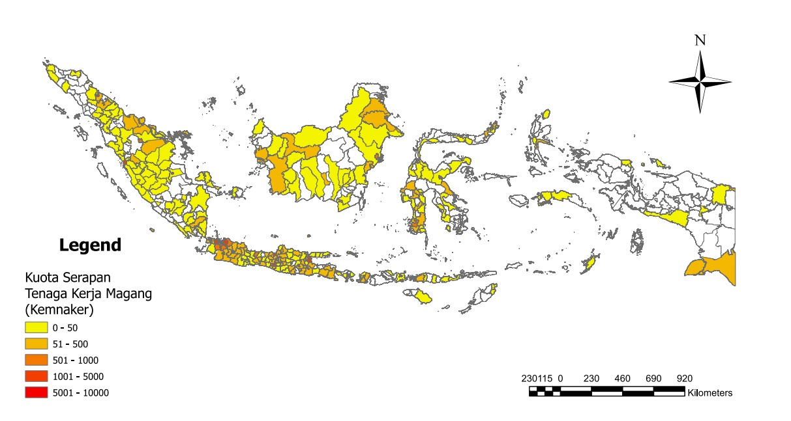

# Dataset Magang Kemnaker Batch 2

## 1 Latar Belakang

## 2 Tinjauan Pustaka

### 2.1 UMP

#### Tabel 2.1 UMP 2025, Kemnaker

| No | Provinsi           | Upah Minimum (Rp)  |
|----|--------------------|--------------------|
| 11 | DKI Jakarta        | 5.396.761,00      |
| 35 | Papua              | 4.285.850,00      |
| 36 | Papua Selatan      | 4.285.850,00      |
| 38 | Papua Pegunungan   | 4.285.850,00      |
| 37 | Papua Tengah       | 4.285.848,00      |
| 9  | Bangka Belitung    | 3.876.600,00      |
| 25 | Sulawesi Utara     | 3.775.425,00      |
| 1  | Aceh               | 3.685.616,00      |
| 6  | Sumatera Selatan   | 3.681.571,00      |
| 27 | Sulawesi Selatan   | 3.657.527,37      |

## 3 Metode

## 4 Hasil

### Tabel 4.1 Lima Kabupaten/Kota Serapan TK Tertinggi
| BPS   | Nama                        | Serapan Total | Serapan Afiliasi Pemerintah | Persentase Afiliasi |
|-------|-----------------------------|---------------|-----------------------------|---------------------|
| 3174  | KOTA ADM. JAKARTA SELATAN   | 9790          | 1984                        | 20,27%              |
| 3171  | KOTA ADM. JAKARTA PUSAT     | 7158          | 1904                        | 26,80%              |
| 3578  | KOTA SURABAYA               | 2340          | 274                         | 11,71%              |
| 7371  | KOTA MAKASSAR               | 2298          | 1202                        | 52,35%              |
| 3273  | KOTA BANDUNG                | 2142          | 408                         | 18,95%              |

### Tabel 4.2 Kebutuhan Jurusan Tertinggi Program Magang Kemnaker

| Jurusan           | Persentase |
|-------------------|------------|
| Akuntansi         | 6,02%      |
| Administrasi      | 5,51%      |
| Ilmu Komunikasi   | 5,83%      |
| Manajemen         | 5,25%      |
| Teknik Industri   | 4,50%      |
| Jurusan lain      | 72,89%     |

### Tabel 4.3 Persyaratan Diploma/Sarjana

| Pendidikan         | Jumlah  | Persentase |
|--------------------|---------|------------|
| Sarjana            | 14380   | 45,62%     |
| Sarjana, Diploma   | 3786    | 12,01%     |
| Diploma            | 2176    | 6,90%      |
| Lainnya            | 11402   | 35,47%     |

### Tabel 4.4 Kuota Penerimaan Tertinggi

| Profesi         | Instansi                                               | Kuota |
|-----------------|-------------------------------------------------------|-------|
| Penyuluh KB     | BKKBN Jawa Timur                                      | 118   |
| Penyuluh KB     | BKKBN Jawa Timur                                      | 118   |
| Penyuluh KB     | BKKBN Jawa Tengah                                     | 103   |
| Penyuluh KB     | BKKBN Jawa Tengah                                     | 103   |
| Perawat         | Rumah Sakit Jantung dan Pembuluh Darah Harapan Kita Jakarta | 101   |
| Perawat         | Rumah Sakit Jantung dan Pembuluh Darah Harapan Kita Jakarta | 101   |

## Kesimpulan dan Diskusi